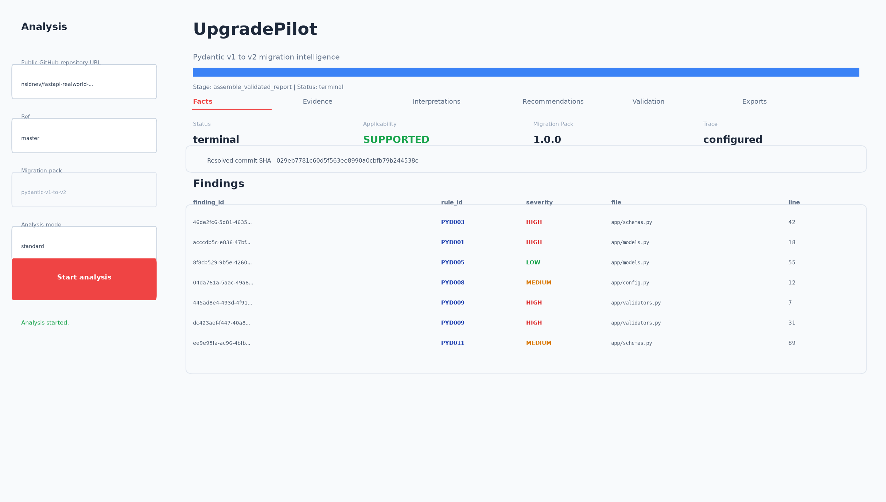
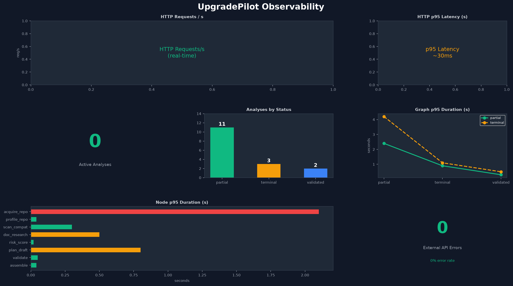
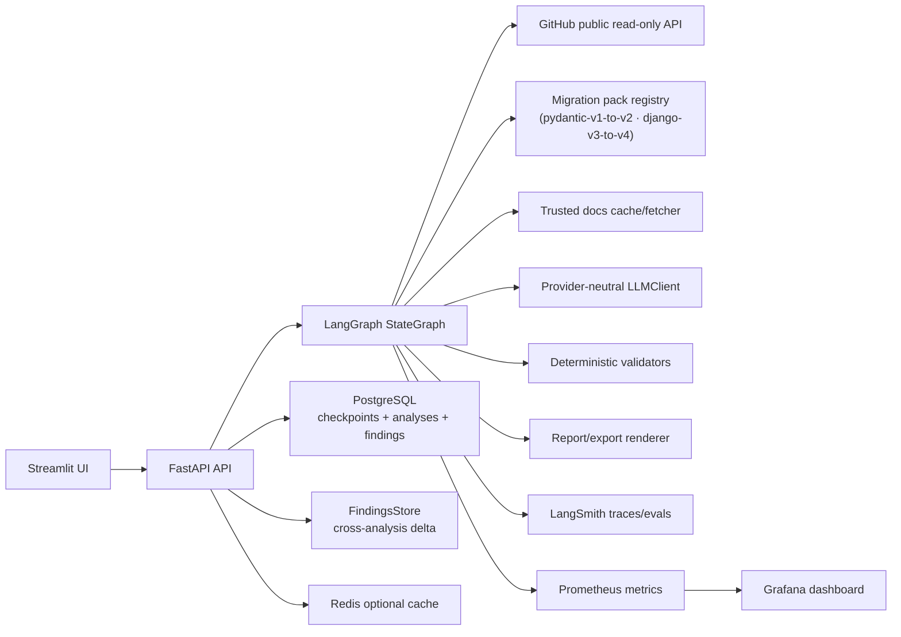
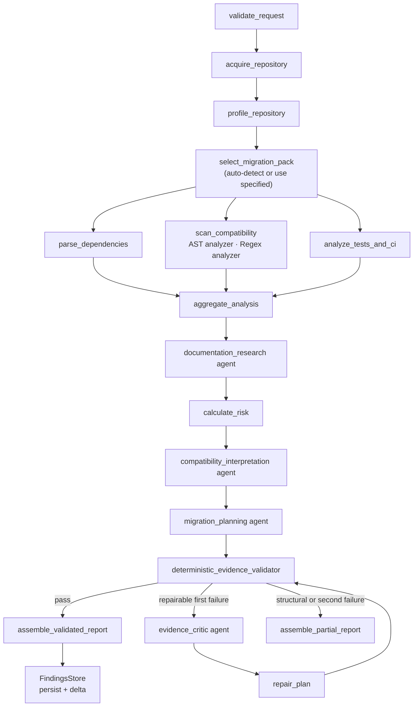

# CodeShift Agent — UpgradePilot V1

Agentic code migration intelligence built with **LangGraph StateGraph**, deterministic AST/regex scanning, **LangSmith evaluation harness**, and full **Prometheus + Grafana observability**.

V1 ships two migration packs — **Pydantic v1→v2** (AST) and **Django v3→v4** (regex) — with automatic pack detection when no pack is specified. The architecture is fully migration-pack extensible to any language or framework upgrade.

## Screenshots

### Streamlit UI — Live findings from a real Pydantic v1 repo


### Grafana Observability Dashboard — Real-time pipeline metrics


---

UpgradePilot is an agentic, evidence-validated migration intelligence system for public Python repositories. It supports multiple migration packs and automatically selects the best-matching pack when one is not specified.

It does not edit code, open pull requests, run repository tests, or claim a migration will succeed. V1 produces read-only findings, risk scoring, official-documentation evidence, and a reviewed migration plan that maintainers can use as a starting point.

## Why It Exists

Framework migrations are easy to underestimate: a repository can mix deprecated patterns, renamed APIs, removed imports, changed configuration, and untested runtime behavior. UpgradePilot turns that repo-specific surface area into an auditable report with exact files, exact lines, bounded snippets, official evidence, and deterministic validation — and tracks progress across runs with content-addressed delta detection.

## What V1 Does

- Accepts a public GitHub repository URL and requested ref.
- Resolves the repository to a commit SHA.
- Profiles Python files, manifests, tests, CI, and dependency signals.
- Auto-detects the best migration pack from installed packs, or uses the one you specify.
- Scans source with deterministic AST rules (Pydantic pack) or regex rules (Django pack).
- Retrieves allowlisted official documentation evidence with cached fallback.
- Calculates deterministic risk before planning.
- Uses bounded LLM agents for interpretation, planning, and one repair path.
- Validates every PlanClaim against known files, lines, findings, docs, packages, and rules.
- Persists findings relationally and computes a run-to-run delta (new / resolved / unchanged).
- Exports JSON, Markdown, and GitHub issue-body drafts.
- Emits LangSmith traces, Prometheus metrics, and degraded-observability warnings.

## Migration Packs

| Pack ID | Framework | Analyzer | Source → Target |
|---|---|---|---|
| `pydantic-v1-to-v2` | Pydantic | AST | v1 → v2 |
| `django-v3-to-v4` | Django | Regex | v3 → v4 |

Pass `"migration_pack": null` (or omit the field) for automatic selection. The `select_migration_pack` node scores all installed packs against the repository profile and picks the highest-confidence match.

## Architecture



Graph node flow:



More detail: [docs/architecture.md](docs/architecture.md).

## Quick Start

Prerequisites:

- Python 3.12
- `uv`
- Docker and Docker Compose

Configure local environment:

```bash
cp .env.example .env
# Fill LLM_API_KEY for live LLM-backed analyses.
# Fill LANGSMITH_API_KEY to enable cloud traces and regression experiments.
```

Start the local stack:

```bash
docker compose up --build
```

Services:

| Service | URL |
|---|---|
| Streamlit UI | http://localhost:8501 |
| API docs | http://localhost:8000/docs |
| API readiness | http://localhost:8000/health/ready |
| Metrics | http://localhost:8000/metrics |
| Prometheus | http://localhost:9090 |
| Grafana | http://localhost:3000 |

Run local development gates:

```bash
uv sync
uv run ruff format --check .
uv run ruff check .
uv run mypy src
uv run pytest
uv run python -m evals.run --suite smoke --backend local
```

## Demonstration

1. Start the stack with `docker compose up --build`.
2. Open http://localhost:8501.
3. Enter a public repository URL and ref.
4. Select a migration pack from the dropdown, or leave it on **Auto-detect (recommended)**.
5. Use `fixture` mode for a deterministic no-network demo, or `standard` mode for live public GitHub analysis.
6. Review the Facts, Evidence, Interpretations, Recommendations, Validation, and Exports tabs.
7. Download JSON, Markdown, or GitHub issue-body drafts.
8. Submit useful/not-useful feedback. If LangSmith is configured, feedback attaches to the root run.
9. Re-run the same repository after making changes — the Facts tab shows delta (new/resolved/unchanged findings).

Pinned public examples are documented in [docs/public_examples.md](docs/public_examples.md).

## API

Core analysis endpoints:

- `POST /analyses`
- `GET /analyses/{analysis_id}`
- `GET /analyses/{analysis_id}/events`
- `GET /analyses/{analysis_id}/report`
- `GET /analyses/{analysis_id}/report.json`
- `GET /analyses/{analysis_id}/report.md`
- `GET /analyses/{analysis_id}/github-issue.md`
- `POST /analyses/{analysis_id}/feedback`

Cross-analysis memory endpoints (require PostgreSQL with findings store):

- `GET /analyses/{analysis_id}/delta` — new / resolved / unchanged vs previous run
- `GET /packs/{pack_id}/stats` — fleet-wide rule frequency across all repos
- `GET /repos/{owner}/{repo}/history` — chronological analysis history for a repository

Pack discovery:

- `GET /packs` — list all installed migration packs with metadata

## Cross-Analysis Memory

After each validated analysis, UpgradePilot persists individual findings into a relational `findings` table keyed by a content hash (`SHA256(pack_id|rule_id|file|line_start|symbol)`). On the next run for the same repository, it computes a delta:

```
Run 1 (commit a1b2c3):  7 findings
Run 2 (commit d4e5f6):  5 findings

Delta:
  new:      0   (no new regressions)
  resolved: 2   (PYD001 app/models.py:18, PYD011 app/schemas.py:89)
  unchanged: 5
```

This turns UpgradePilot from a one-shot scanner into a **continuous migration tracker** — teams can commit fixes incrementally and see exactly what changed each sprint.

## Evaluation Results

Release evaluation results are recorded in [EVAL_RESULTS.md](EVAL_RESULTS.md). The smoke suite runs 51 cases covering Pydantic detection, Django detection, applicability, planning, and chaos scenarios. The local evaluation harness writes machine-readable outputs under `eval_results/` during a run.

Commands:

```bash
uv run python -m evals.run --suite all --backend local
uv run python -m evals.run --suite regression --backend langsmith
uv run python -m evals.compare --baseline <name> --candidate <name>
```

## Security Posture

The repository under analysis is treated as attacker-controlled input. UpgradePilot does not execute repository code. It rejects unsafe archives, blocks private-network SSRF targets, bounds source snippets, masks secrets before logging/tracing, uses allowlisted documentation sources, and validates generated claims deterministically.

Security notes:

- [docs/security/SECURITY.md](docs/security/SECURITY.md)
- [docs/security/SECURITY_SCAN_RESULTS.md](docs/security/SECURITY_SCAN_RESULTS.md)
- [docs/security/sbom.cdx.json](docs/security/sbom.cdx.json)

## Major Decisions

ADRs are in [docs/adr/](docs/adr/):

- LangGraph StateGraph orchestration
- deterministic evidence validation before reports
- trusted official documentation only
- degraded observability without analysis failure
- read-only V1 scope
- migration-pack extensibility with auto-detect

## Known Limitations

See [docs/known_limitations.md](docs/known_limitations.md). In short: V1 supports public repositories only, read-only recommendations, in-process API analysis status index (lost on restart), and fixture-backed local public migration examples. Cross-analysis memory requires PostgreSQL — it is silently skipped in fixture mode.

## Production Hardening Roadmap

See [docs/production_hardening_roadmap.md](docs/production_hardening_roadmap.md). Items include durable analysis status storage, stronger auth/rate limiting, managed secrets, external container scanners, private repository support, and additional migration packs.
