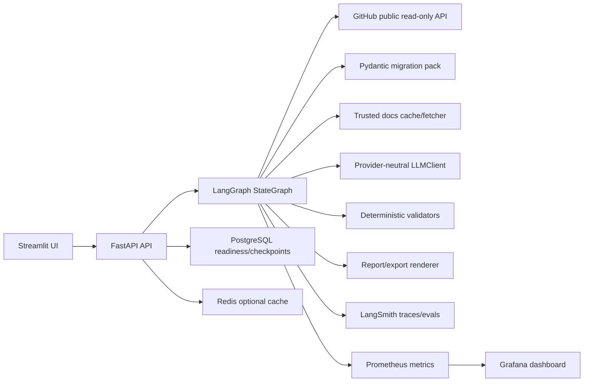
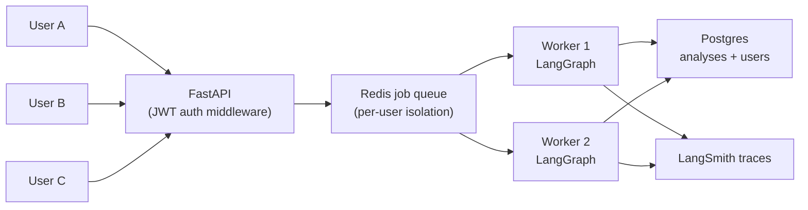

# CodeShift Agent — UpgradePilot V1

Agentic code migration intelligence built with **LangGraph StateGraph**, deterministic AST scanning, **LangSmith evaluation harness**, and full **Prometheus + Grafana observability**.

V1 target: Pydantic v1 → v2. Architecture is migration-pack extensible to any language or framework upgrade.

## Screenshots

### Streamlit UI — Live findings from a real Pydantic v1 repo


### Grafana Observability Dashboard — Real-time pipeline metrics


---

UpgradePilot is an agentic, evidence-validated migration intelligence system for
public Python repositories moving from Pydantic v1 to Pydantic v2.

It does not edit code, open pull requests, run repository tests, or claim a migration
will succeed. V1 produces read-only findings, risk scoring, official-documentation
evidence, and a reviewed migration plan that maintainers can use as a starting point.

## Why It Exists

Pydantic migrations are easy to underestimate: a repository can mix validators,
serialization methods, config classes, compatibility shims, dependency constraints,
and untested runtime behavior. UpgradePilot turns that repo-specific surface area into
an auditable report with exact files, exact lines, bounded snippets, official evidence,
and deterministic validation before anything is shown as a recommendation.

## What V1 Does

- Accepts a public GitHub repository URL and requested ref.
- Resolves the repository to a commit SHA.
- Profiles Python files, manifests, tests, CI, and Pydantic dependency signals.
- Scans source with deterministic AST rules from the Pydantic v1-to-v2 migration pack.
- Retrieves allowlisted official Pydantic documentation evidence with cached fallback.
- Calculates deterministic risk before planning.
- Uses bounded LLM agents for interpretation, planning, and one repair path.
- Validates every PlanClaim against known files, lines, findings, docs, packages, and rules.
- Exports JSON, Markdown, and GitHub issue-body drafts.
- Emits LangSmith traces, Prometheus metrics, and degraded-observability warnings.

## Architecture



More detail: [docs/architecture.md](docs/architecture.md).

## Quick Start

Prerequisites:

- Python 3.12
- `uv`
- Docker and Docker Compose

Configure local environment:

```bash
cp .env.example .env
# Fill LLM_API_KEY for live LLM-backed analyses.
# Fill LANGSMITH_API_KEY to enable cloud traces and regression experiments.
```

Start the local stack:

```bash
docker compose up --build
```

Services:

| Service | URL |
|---|---|
| Streamlit UI | http://localhost:8501 |
| API docs | http://localhost:8000/docs |
| API readiness | http://localhost:8000/health/ready |
| Metrics | http://localhost:8000/metrics |
| Prometheus | http://localhost:9090 |
| Grafana | http://localhost:3000 |

Run local development gates:

```bash
uv sync
uv run ruff format --check .
uv run ruff check .
uv run mypy src
uv run pytest
uv run python -m evals.run --suite smoke --backend local
```

## Demonstration

1. Start the stack with `docker compose up --build`.
2. Open http://localhost:8501.
3. Enter a public repository URL and ref.
4. Use `fixture` mode for a deterministic no-network demo, or `standard` mode for live
   public GitHub analysis.
5. Review the Facts, Evidence, Interpretations, Recommendations, Validation, and Exports tabs.
6. Download JSON, Markdown, or GitHub issue-body drafts.
7. Submit useful/not-useful feedback. If LangSmith is configured, feedback attaches to the root run.

Pinned public examples are documented in [docs/public_examples.md](docs/public_examples.md).

## API

Important endpoints:

- `POST /analyses`
- `GET /analyses/{analysis_id}`
- `GET /analyses/{analysis_id}/events`
- `GET /analyses/{analysis_id}/report`
- `GET /analyses/{analysis_id}/report.json`
- `GET /analyses/{analysis_id}/report.md`
- `GET /analyses/{analysis_id}/github-issue.md`
- `POST /analyses/{analysis_id}/feedback`

## Evaluation Results

Release evaluation results are recorded in [EVAL_RESULTS.md](EVAL_RESULTS.md). The local
evaluation harness writes machine-readable outputs under `eval_results/` during a run.

Commands:

```bash
uv run python -m evals.run --suite all --backend local
uv run python -m evals.run --suite regression --backend langsmith
uv run python -m evals.compare --baseline <name> --candidate <name>
```

## Security Posture

The repository under analysis is treated as attacker-controlled input. UpgradePilot does
not execute repository code. It rejects unsafe archives, blocks private-network SSRF
targets, bounds source snippets, masks secrets before logging/tracing, uses allowlisted
documentation sources, and validates generated claims deterministically.

Security notes:

- [docs/security/SECURITY.md](docs/security/SECURITY.md)
- [docs/security/SECURITY_SCAN_RESULTS.md](docs/security/SECURITY_SCAN_RESULTS.md)
- [docs/security/sbom.cdx.json](docs/security/sbom.cdx.json)

## Major Decisions

ADRs are in [docs/adr/](docs/adr/):

- LangGraph StateGraph orchestration
- deterministic evidence validation before reports
- trusted official documentation only
- degraded observability without analysis failure
- read-only V1 scope

## Known Limitations

See [docs/known_limitations.md](docs/known_limitations.md). In short: V1 supports public
repositories only, only the Pydantic v1-to-v2 pack, read-only recommendations, in-process
API analysis storage, and fixture-backed local public migration examples.

## Production Hardening Roadmap

See [docs/production_hardening_roadmap.md](docs/production_hardening_roadmap.md). Items
include durable analysis storage, stronger auth/rate limiting, managed secrets, external
container scanners, private repository support, and broader migration packs.

---

## V2 Architecture — Multi-User, Memory & Delta Detection

V1 is single-user and stateless across runs. V2 extends the existing Postgres + Redis + LangGraph stack to support concurrent users and cross-run memory without a rewrite.

### Multi-User



**What changes:**
- `users` table in Postgres (id, email, created_at) — auth via JWT / OAuth2
- `analyses` table gets a `user_id` foreign key — each user sees only their own runs
- Redis job queue scopes worker slots per user to prevent one user starving others
- FastAPI middleware validates JWT on every request — zero changes to the LangGraph graph itself

### Cross-Run Memory via LangGraph Checkpointer

The checkpointer is already wired in V1. V2 activates it with a stable `thread_id`:

```python
thread_id = sha256(f"{user_id}:{repo_url}")
```

Same user + same repo → LangGraph resumes from the previous checkpoint. The graph can read
its own prior output (findings list, commit SHA, risk score) before running the new analysis.

### Delta Detection

When a user re-analyzes the same repository, the system compares the new findings against
the stored checkpoint from the previous run and produces a delta report:

```
Run 1  (2026-07-18, commit 029eb77):  7 findings
  PYD001  app/models.py:18      HIGH
  PYD003  app/schemas.py:42     HIGH
  PYD005  app/models.py:55      LOW
  PYD008  app/config.py:12      MEDIUM
  PYD009  app/validators.py:7   HIGH
  PYD009  app/validators.py:31  HIGH
  PYD011  app/schemas.py:89     MEDIUM

Run 2  (2026-07-25, commit a3f9c12):  5 findings

Delta:
  ✅ FIXED       PYD001  app/models.py:18       (.dict() replaced with .model_dump())
  ✅ FIXED       PYD011  app/schemas.py:89      (Field alias removed)
  📌 STILL OPEN  5 findings remain
  ⚠️  NEW         (none introduced)
```

**Why this matters:** most static analysis tools are stateless scanners — run once, get a
report. Delta detection turns CodeShift Agent into a **continuous migration tracker**: teams
can commit fixes incrementally and see exactly what progress was made each sprint, without
manually diffing two JSON reports.

**Implementation:** pure set difference on `(rule_id, file_path, start_line)` tuples between
the current findings and the checkpointed findings. No LLM involved — deterministic, fast,
auditable.

### V2 at a Glance

| Capability | V1 | V2 |
|---|---|---|
| Users | Anonymous, single | JWT auth, multi-tenant |
| Analysis history | Lost on refresh | Persistent per user in Postgres |
| Concurrent analyses | Single-process | Redis queue + N workers |
| Cross-run memory | None | LangGraph checkpointer (thread_id) |
| Delta detection | None | Set diff of findings across runs |
| Migration packs | Pydantic v1→v2 | Extensible: Django, SQLAlchemy, … |
