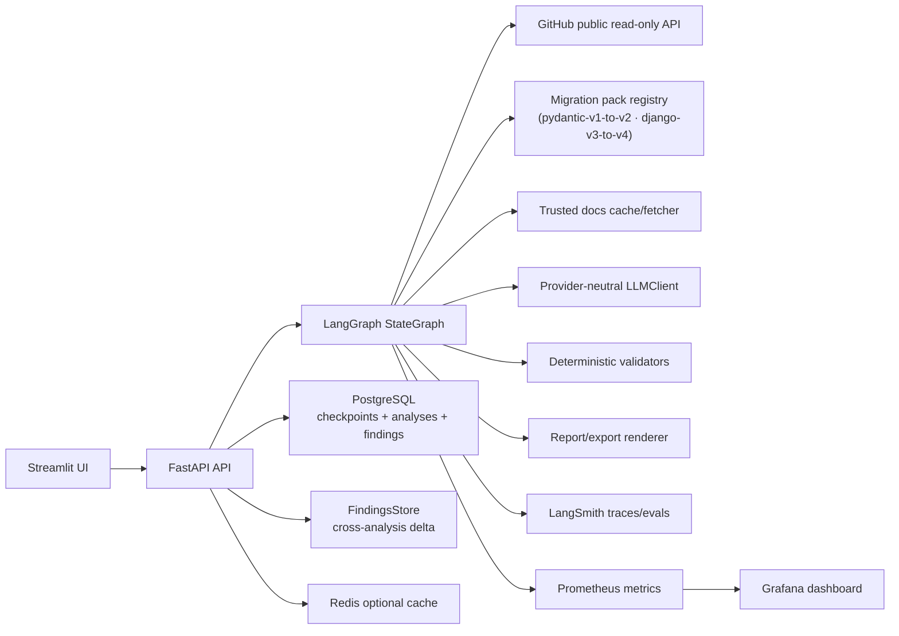
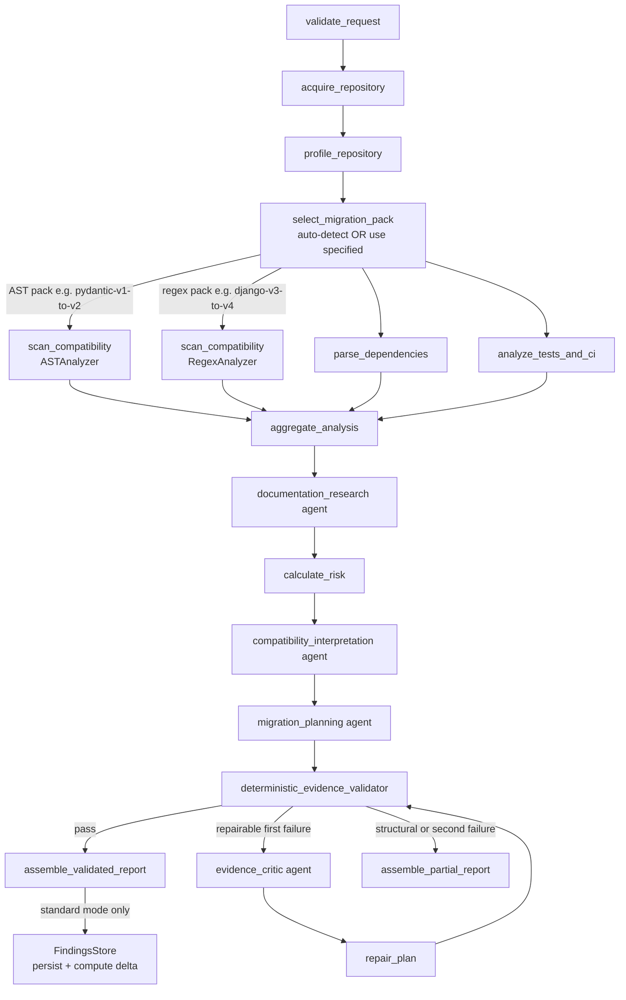

# Architecture

UpgradePilot V1 is a read-only migration intelligence application. The central design
choice is to keep deterministic logic in services and validators, while using bounded
agents only for interpretation and planning language.

## System Overview



## Graph Node Flow



## Migration Pack System

A migration pack is a YAML-driven descriptor that bundles:

- **Metadata** — pack ID, display name, language, analyzer kind, source/target major versions
- **Applicability signals** — manifest file names and patterns that indicate the source package is present
- **Rules** — one rule per anti-pattern, each with an ID, severity, category, description, and analyzer-specific match expression
- **Evidence map** — canonical documentation URLs keyed by rule ID

The `ApplicabilityEngine` evaluates all installed packs against the `RepositoryProfile` and returns a scored list of `PackCandidate` objects. The `select_migration_pack` node picks the highest-confidence match when no pack is specified by the caller.

### Installed Packs

| Pack ID | Analyzer | Source → Target | Signal |
|---|---|---|---|
| `pydantic-v1-to-v2` | AST | Pydantic v1 → v2 | `pydantic<2` in manifests |
| `django-v3-to-v4` | Regex | Django v3 → v4 | `django>=3,<4` in manifests |

### Analyzers

- **`ASTAnalyzer`** — tree-sitter AST walker; used for structural patterns like import aliases, decorator usage, and attribute access chains. Matches are precise to the token.
- **`RegexAnalyzer`** — line-oriented regex scanner; used for string-based patterns like deprecated function calls, removed settings keys, and renamed template tags.

## Boundaries

- FastAPI owns request/response models, progress streaming, exports, and feedback.
- LangGraph owns node routing and termination.
- Analyzers and tools own deterministic repository/profile/finding behavior.
- Agents own one narrow LLM-backed objective each.
- Validators own report trust. They never silently modify evidence.
- Observability wraps graph nodes without becoming business logic.
- FindingsStore owns cross-analysis persistence and delta; it is never in the graph hot path.

## Data Flow

1. A request is validated as a public GitHub repository URL.
2. GitHub ref resolution pins analysis to a commit SHA.
3. Archive download and extraction apply size, count, path, symlink, and SSRF controls.
4. The repository profile determines applicability; the best pack is auto-selected if needed.
5. Deterministic scanners emit findings with exact files, lines, rules, pack version, and evidence snippets.
6. Trusted documentation lookup returns bounded official-source evidence.
7. Risk scoring is deterministic and runs before planning.
8. Agents produce structured Pydantic outputs with one LLM call each.
9. Evidence validators check files, lines, snippets, rule IDs, docs, package claims, prohibited claims, and length limits.
10. Reports are assembled as validated, partial, or terminal.
11. After a validated report, findings are persisted relationally and a run-to-run delta is computed (fire-and-forget, skipped in fixture mode).

## Cross-Analysis Memory

After each validated analysis completes, `_persist_findings` runs as an `asyncio.create_task`:

1. Extracts `owner`, `repo`, `commit_sha` from the graph snapshot.
2. Calls `FindingsStore.persist_analysis` — upserts the `analyses` row and inserts individual `findings` rows (idempotent; ignores conflicts on `finding_id`).
3. Calls `FindingsStore.delta_vs_previous` — compares content hashes of current findings against the previous validated analysis for the same repository. Returns `FindingsDelta` with `new_count`, `resolved_count`, `unchanged_count`, and lists of changed rule IDs.
4. Writes the delta back to the `analyses` row via `STORE.update`.

Content hash: `SHA256(pack_id|rule_id|file|line_start|symbol)` — deterministic, order-independent, content-addressed.

New API endpoints exposed by this feature:

| Endpoint | Description |
|---|---|
| `GET /analyses/{id}/delta` | New / resolved / unchanged vs previous run |
| `GET /packs/{pack_id}/stats` | Fleet-wide rule frequency across all repos |
| `GET /repos/{owner}/{repo}/history` | Chronological analysis history for a repo |

## Observability

Root trace name: `upgradepilot.analysis`.

Child run prefixes:

- `node.*`
- `tool.*`
- `agent.*`
- `validator.*`
- `report.*`
- `llm.*`

Trace metadata includes analysis ID, request ID, repository owner/name, requested ref,
resolved commit SHA, migration pack ID/version, app version, environment, mode, model,
prompt versions, report status, repair count, cache state, and validation results.

Prometheus metrics (17 total):

| Metric | Type | Labels |
|---|---|---|
| `upgradepilot_http_requests_total` | Counter | method, path, status |
| `upgradepilot_http_request_duration_seconds` | Histogram | method, path |
| `upgradepilot_analyses_active` | Gauge | — |
| `upgradepilot_analyses_total` | Counter | status |
| `upgradepilot_analysis_duration_seconds` | Histogram | status |
| `upgradepilot_graph_duration_seconds` | Histogram | status |
| `upgradepilot_graph_node_duration_seconds` | Histogram | node, category, status |
| `upgradepilot_graph_node_runs_total` | Counter | node, category, status |
| `upgradepilot_llm_calls_total` | Counter | agent, status |
| `upgradepilot_llm_tokens_total` | Counter | direction |
| `upgradepilot_external_api_errors_total` | Counter | service |
| `upgradepilot_cache_hits_total` | Counter | key_type |
| `upgradepilot_cache_misses_total` | Counter | key_type |
| `upgradepilot_validation_issues_total` | Counter | severity |
| `upgradepilot_findings_persisted_total` | Counter | pack_id |
| `upgradepilot_delta_new_findings_total` | Counter | pack_id |
| `upgradepilot_delta_resolved_findings_total` | Counter | pack_id |

## Persistence

V1 standard API analyses compile the LangGraph with PostgreSQL checkpointing. Fixture
analyses use an in-memory saver so local tests remain deterministic. The API status/event
index is process-local and intentionally documented as a V1 limitation.

The `findings` table extends persistence with relational per-finding rows:

```sql
findings (
    finding_id      UUID PRIMARY KEY,
    analysis_id     UUID NOT NULL REFERENCES analyses(analysis_id) ON DELETE CASCADE,
    pack_id         TEXT NOT NULL,
    pack_version    TEXT NOT NULL,
    rule_id         TEXT NOT NULL,
    category        TEXT NOT NULL,
    severity        TEXT NOT NULL,
    file            TEXT NOT NULL,
    line_start      INT  NOT NULL,
    line_end        INT  NOT NULL,
    symbol          TEXT NOT NULL,
    confidence      FLOAT NOT NULL,
    match_kind      TEXT NOT NULL,
    content_hash    TEXT NOT NULL,
    created_at      TIMESTAMPTZ NOT NULL DEFAULT now()
)
```
