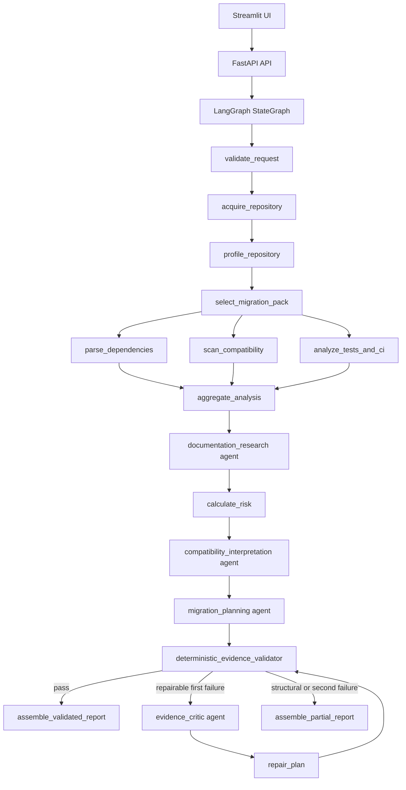

# Architecture

UpgradePilot V1 is a read-only migration intelligence application. The central design
choice is to keep deterministic logic in services and validators, while using bounded
agents only for interpretation and planning language.

## Boundaries

- FastAPI owns request/response models, progress streaming, exports, and feedback.
- LangGraph owns node routing and termination.
- Analyzers and tools own deterministic repository/profile/finding behavior.
- Agents own one narrow LLM-backed objective each.
- Validators own report trust. They never silently modify evidence.
- Observability wraps graph nodes without becoming business logic.

## Data Flow

1. A request is validated as a public GitHub repository URL.
2. GitHub ref resolution pins analysis to a commit SHA.
3. Archive download and extraction apply size, count, path, symlink, and SSRF controls.
4. The repository profile determines applicability.
5. Deterministic scanners emit findings with exact files, lines, rules, pack version, and evidence snippets.
6. Trusted documentation lookup returns bounded official-source evidence.
7. Risk scoring is deterministic and runs before planning.
8. Agents produce structured Pydantic outputs with one LLM call each.
9. Evidence validators check files, lines, snippets, rule IDs, docs, package claims, prohibited claims, and length limits.
10. Reports are assembled as validated, partial, or terminal.

## Observability

Root trace name: `upgradepilot.analysis`.

Child run prefixes:

- `node.*`
- `tool.*`
- `agent.*`
- `validator.*`
- `report.*`
- `llm.*`

Trace metadata includes analysis ID, request ID, repository owner/name, requested ref,
resolved commit SHA, migration pack ID/version, app version, environment, mode, model,
prompt versions, report status, repair count, cache state, and validation results.

## Persistence

V1 standard API analyses compile the LangGraph with PostgreSQL checkpointing. Fixture
analyses use an in-memory saver so local tests remain deterministic. The API status/event
index is process-local and intentionally documented as a V1 limitation.
